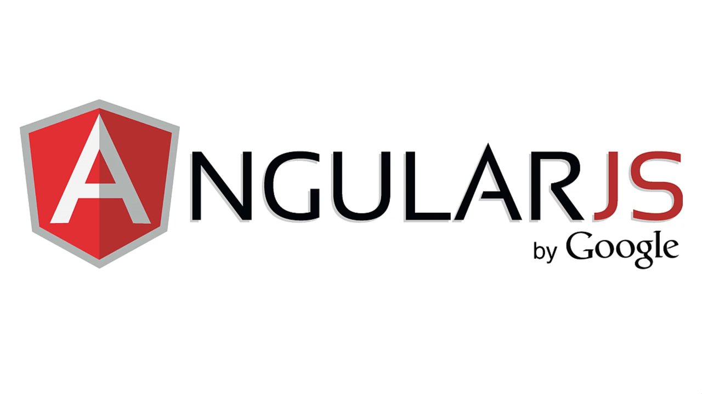
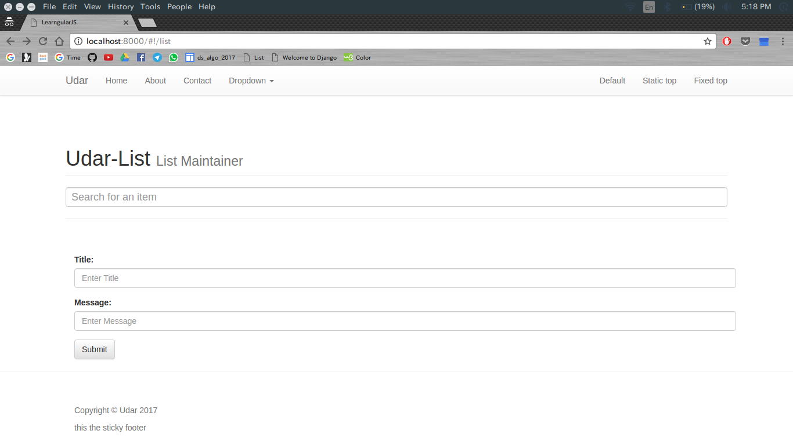
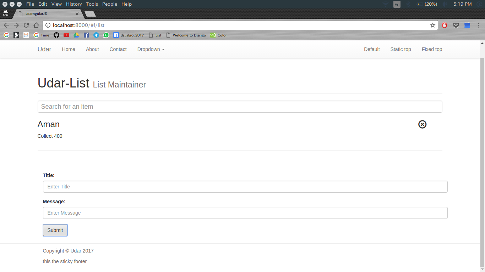
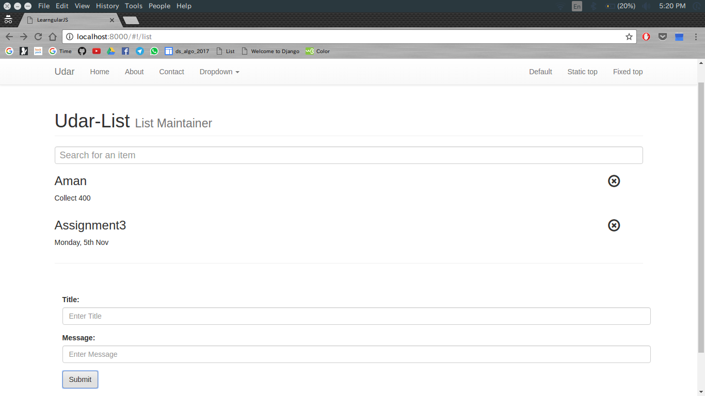
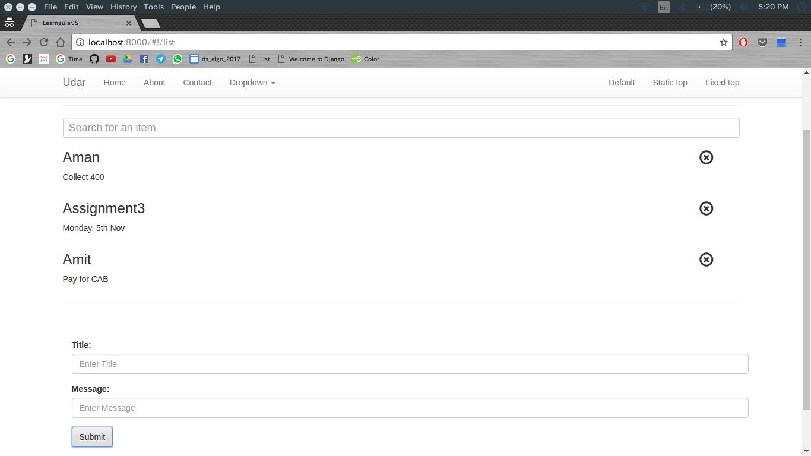
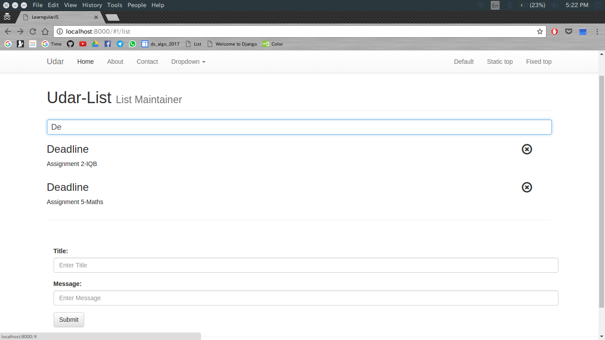

# learngularJS
 

# UDAR
Basic listing application. Uses angularJS and its MVC framework throughout the web application.

## Aim
The main aim of the appication is to analyse and implement the concepts of angularJS and learn how to use its MVC framework.

## Features
- Adding items
- Removing Items
- Searching for the desired item (Search Box)
- URL resolving and routing and redirection
- Support for addition of as many pages an required
- Angular Filters
- Angular Controllers
- Angular Animations and Transitions

## How to View
- Host the application on any server 
- Replace 'home' in the url that you will be directed to, with 'list'
- That it!

## Screenshots

 

 

## Technologies Used

- HTML
- CSS
- Javascript
- AngularJS
- JSON

## Applications
This is a general application that can be used whenever listing is required.
These include:

1. Chat applications.
2. Expense Tracking
3. TO-DO list
4. etc.

